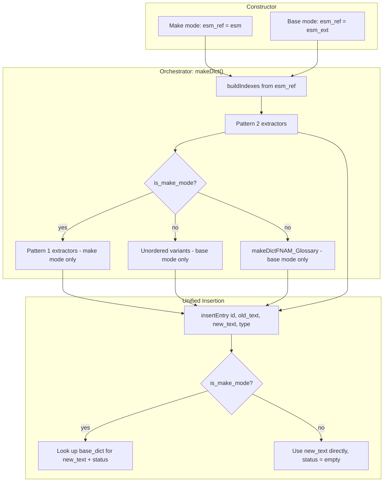
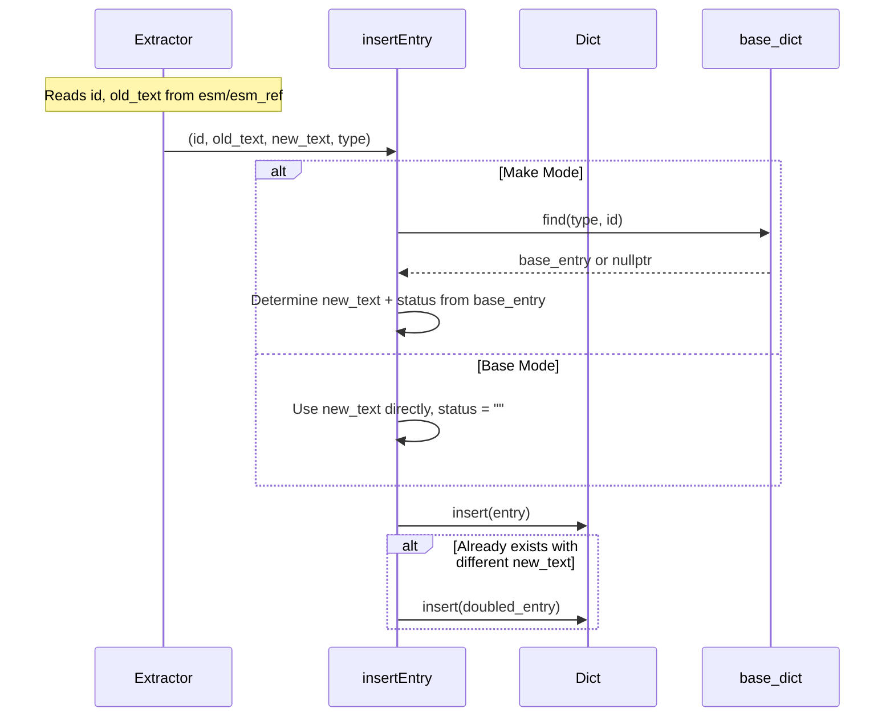

# Design Document: Make-Base Original Field

## Overview

This refactoring transforms DictCreator from a dual-path architecture (separate `insertRecord`/`insertRecordToDict` functions, `if (is_make_mode)` branches in every extractor, `isSameOrder()` branching in the orchestrator) into a unified architecture where:

1. A single `insertEntry(id, old_text, new_text, type)` function handles both modes
2. All extractors have a single loop with no mode branching — they read `old_text` from `esm_ref` (which transparently points to the correct ESM)
3. Pattern 2 extractors use pre-built indexes for O(1) lookup into `esm_ref`
4. Pattern 1 extractors become make-mode-only; base mode always uses unordered (fingerprint) variants
5. A single `makeDict()` orchestrator replaces `makeDictForMake()` and `makeDictForBase()`
6. JSON keys are renamed: `"original"` → `"old"`, `"translation"` → `"new"`
7. RecordEntry fields are renamed: `id` → `key_text`, `original` → `old_text`, `translation` → `new_text`

The key insight: `esm_ref` is bound to `esm` in make mode and `esm_ext` in base mode. By reading `old_text` from `esm_ref` in all extractors, the same code produces native text in make mode and foreign text in base mode — eliminating all mode branches from extractors.

## Architecture



### Two Extractor Patterns

**Pattern 1 (CELL, DIAL, Script):** The translatable text IS the lookup key (cell name, topic name, script line). No stable internal key exists for cross-ESM matching. Make mode uses simple iteration with same-index pairing via `esm_ref`. Base mode uses fingerprint/key matching via unordered variants.

**Pattern 2 (GMST, FNAM, DESC, TEXT, RNAM, INDX, NPC_FLAG, INFO):** Records have stable internal keys (NAME subrecord, INDX subrecord, INAM subrecord) that are identical across language versions. A pre-built `unordered_map` index maps these keys to positions in `esm_ref`, enabling O(1) lookup for both modes.

## Components and Interfaces

### RecordEntry (tools.hpp)

```cpp
struct RecordEntry
{
    std::string key_text;   // composite lookup key (JSON: "id")
    std::string old_text;   // foreign/source text (JSON: "old")
    std::string new_text;   // native/translated text (JSON: "new")
    std::string status;     // translation state (JSON: "status")
};
```

### insertEntry (replaces insertRecord + insertRecordToDict)

```cpp
void insertEntry(const std::string & id, const std::string & old_text,
                 const std::string & new_text, Tools::RecType type);
```

**Make mode behavior:**
- Sets `entry.key_text = id`
- Sets `entry.old_text = old_text`
- Looks up `base_dict[type].find(id)` for `new_text` and `status`
- If found and `base_entry->old_text == old_text`: uses base entry's `new_text`, sets status to `translated` or `auto_identical`
- If found but `old_text` differs: uses base entry's `new_text`, sets status to `changed`
- If not found: sets `new_text = ""`, status = `untranslated`

**Base mode behavior:**
- Sets `entry.key_text = id`
- Sets `entry.old_text = old_text`
- Sets `entry.new_text = new_text`
- Sets `entry.status = ""`
- On duplicate with different `new_text`: creates DOUBLED entry with same `old_text`

### buildIndexes()

```cpp
void buildIndexes();
```

Iterates `esm_ref` once and builds `unordered_map<string, size_t>` for each Pattern 2 record type:

| Record Type | Key Format | Value Subrecord |
|-------------|-----------|-----------------|
| GMST | `NAME` (e.g. `"sDefaultCellname"`) | STRV |
| FNAM | `rec_id^NAME` (e.g. `"ACTI^A_Ex_De_Oar"`) | FNAM |
| DESC | `rec_id^NAME` (e.g. `"BSGN^The Apprentice"`) | DESC |
| TEXT | `NAME` (e.g. `"bk_ABCs"`) | TEXT |
| RNAM | `NAME^counter` (e.g. `"Fighters Guild^0"`) | RNAM |
| INDX | `rec_id^INDX` (e.g. `"SKIL^000"`) | DESC |
| NPC_FLAG | `NAME` (e.g. `"Caius Cosades"`) | FLAG |
| INFO | `prefix^INAM` (e.g. `"T^background^INFO_ID"`) | NAME |

In make mode, `esm_ref` = `esm`, so indexes point into the native ESM. In base mode, `esm_ref` = `esm_ext`, so indexes point into the foreign ESM. Either way, extractors use the same lookup code.

### makeDict() (replaces makeDictForMake + makeDictForBase)

```cpp
void makeDict();
```

1. Call `buildIndexes()`
2. Call Pattern 2 extractors (work identically in both modes via index + `esm_ref`)
3. If make mode: call Pattern 1 extractors (CELL, CELL_Default, CELL_REGN, DIAL, Script)
4. If base mode: call unordered variants (CELL_Unordered, CELL_Unordered_Default, CELL_Unordered_REGN, DIAL_Unordered, Script_Unordered)
5. If base mode: call `makeDictFNAM_Glossary()`

### Pattern 2 Extractor (example: makeDictFNAM)

After refactoring, a Pattern 2 extractor has a single loop:

```cpp
void DictCreator::makeDictFNAM()
{
    resetCounters();
    for (size_t i = 0; i < esm.getRecords().size(); ++i)
    {
        esm.selectRecord(i);
        if (!Tools::isFNAM(esm.getRecord().id))
            continue;

        esm.setKey("NAME");
        esm.setValue("FNAM");
        if (!esm.getKey().exist || !esm.getValue().exist || esm.getKey().text == "player")
            continue;

        const auto & id = esm.getRecord().id + "^" + esm.getKey().text;
        const auto & new_text = esm.getValue().text;

        std::string old_text;
        auto search = fnam_index.find(id);
        if (search != fnam_index.end())
        {
            esm_ref.selectRecord(search->second);
            esm_ref.setValue("FNAM");
            old_text = esm_ref.getValue().text;
        }
        else
        {
            old_text = new_text;
        }

        insertEntry(id, old_text, new_text, Tools::RecType::FNAM);
    }
    printLogLine(Tools::RecType::FNAM);
}
```

No `if (is_make_mode)` branch. In make mode, `esm_ref` = `esm` and the index points into `esm`, so `old_text` = native text (same as `new_text`). In base mode, `esm_ref` = `esm_ext` and the index points into `esm_ext`, so `old_text` = foreign text.

### Pattern 1 Extractor (example: makeDictCELL — make mode only)

```cpp
void DictCreator::makeDictCELL()
{
    resetCounters();
    for (size_t i = 0; i < esm.getRecords().size(); ++i)
    {
        esm.selectRecord(i);
        if (esm.getRecord().id != "CELL")
            continue;

        esm.setValue("NAME");
        if (!esm.getValue().exist || esm.getValue().text.empty())
            continue;

        const auto & id = esm.getValue().text;
        const auto & old_text = esm.getValue().text;
        insertEntry(id, old_text, "", Tools::RecType::CELL);
    }
    printLogLine(Tools::RecType::CELL);
}
```

Base mode for CELL is handled entirely by `makeDictCELL_Unordered()`.

### Unordered Variants

Unordered variants use `esm_ref` instead of `esm_ext` directly. Since they only run in base mode (where `esm_ref` = `esm_ext`), the behavior is identical but the code is consistent with the rest of the codebase.

They pass `old_text` from the matched `esm_ref` record to `insertEntry`:

```cpp
const auto & key_text = esm_ref.getValue().text;  // foreign text = id for CELL/DIAL
const auto & val_text = esm.getValue().text;       // native text
insertEntry(key_text, key_text, val_text, Tools::RecType::CELL);
```

### DictWriter

Outputs JSON with keys: `"id"`, `"old"`, `"new"`, `"status"` (already implemented).

### DictReader

Parses JSON with keys: `"id"`, `"old"`, `"new"`, `"status"` (already implemented).

## Data Models

### Dictionary Entry Lifecycle



### Index Structure

```cpp
// Member variables added to DictCreator
std::unordered_map<std::string, size_t> gmst_index;
std::unordered_map<std::string, size_t> fnam_index;
std::unordered_map<std::string, size_t> desc_index;
std::unordered_map<std::string, size_t> text_index;
std::unordered_map<std::string, size_t> rnam_index;
std::unordered_map<std::string, size_t> indx_index;
std::unordered_map<std::string, size_t> npc_flag_index;
std::unordered_map<std::string, size_t> info_index;
```

Each maps a composite key string to a record position (index) in `esm_ref`.

### JSON Format

```json
{
  "CELL": [
    {
      "id": "Balmora",
      "old": "Balmora",
      "new": "Balmora",
      "status": "auto_identical"
    }
  ],
  "FNAM": [
    {
      "id": "ACTI^A_Ex_De_Oar",
      "old": "Oar",
      "new": "Wiosło"
    }
  ]
}
```

## Correctness Properties

*A property is a characteristic or behavior that should hold true across all valid executions of a system — essentially, a formal statement about what the system should do. Properties serve as the bridge between human-readable specifications and machine-verifiable correctness guarantees.*

### Property 1: JSON serialization round-trip

*For any* valid dictionary (Dict) containing entries with arbitrary key_text, old_text, new_text, and status values, writing to JSON via DictWriter and reading back via DictReader SHALL produce an equivalent dictionary where each entry's key_text, old_text, new_text, and status fields are preserved exactly.

**Validates: Requirements 13.1, 13.2, 13.3, 13.5**

### Property 2: insertEntry make mode uses base_dict

*For any* valid (id, old_text, new_text, type) input in make mode with a non-null base_dict, the resulting entry's new_text and status SHALL be determined solely by the base_dict lookup (matching on id and old_text), regardless of the new_text parameter value passed to insertEntry.

**Validates: Requirements 14.2, 20.4**

### Property 3: insertEntry base mode uses parameters directly

*For any* valid (id, old_text, new_text, type) input in base mode, the resulting entry SHALL have key_text == id, old_text == old_text parameter, new_text == new_text parameter, and status == "" (empty string).

**Validates: Requirements 1.1, 1.2, 14.3**

### Property 4: All extractors read old_text from esm_ref

*For any* ESM file pair (native + foreign) and any record type, when an extractor produces a dictionary entry, the entry's old_text SHALL equal the text read from `esm_ref` at the corresponding record position — which is native text in make mode (esm_ref = esm) and foreign text in base mode (esm_ref = esm_ext).

**Validates: Requirements 2.1, 3.1, 4.1, 5.1, 6.1, 7.1, 9.1, 10.1, 10.2, 10.3, 10.5, 11.1, 11.2, 12.1, 15.1, 15.2, 16.4, 16.5, 20.2**

### Property 5: DOUBLED entries preserve old_text

*For any* duplicate insertion in base mode (same id, different new_text), the DOUBLED entry SHALL have old_text equal to the old_text parameter passed to insertEntry (not the id).

**Validates: Requirements 1.3**

## Error Handling

### Index Lookup Miss

When a Pattern 2 extractor cannot find a record in the pre-built index (e.g., the native ESM has a record that doesn't exist in the foreign ESM), the extractor falls back to using `new_text` as `old_text`. This handles:
- Records added by one ESM but not present in the other
- Mismatched record counts between ESMs

### Unordered Matching Failure

When an unordered variant cannot find a fingerprint match for a CELL or DIAL record, it marks the entry as `MISSING` and logs a warning. This existing behavior is preserved.

### Empty/Missing Subrecords

Extractors check `getValue().exist` before reading. If a subrecord is missing, the record is skipped (no entry created). This existing behavior is preserved.

## Testing Strategy

### Property-Based Testing

This feature is suitable for property-based testing because:
- `insertEntry` is a pure function (given mode and base_dict state) with clear input/output behavior
- JSON round-trip is a classic PBT pattern
- The input space (arbitrary strings for id, old_text, new_text) is large

**Library:** Catch2 (already in use) does not have built-in PBT. Use a lightweight header-only PBT library compatible with Catch2, or implement generators manually within Catch2 TEST_CASE blocks using random string generation.

**Configuration:** Minimum 100 iterations per property test.

**Tag format:** `Feature: make-base-original-field, Property N: <property_text>`

### Unit Tests (Example-Based)

- Verify CELL/DIAL entries have `old_text == key_text` in base mode (Req 8.1, 8.2, 8.3)
- Verify `makeDictCELL_Unordered_Default` produces correct `old_text` from sDefaultCellname (Req 10.4)
- Verify `makeDictFNAM_Glossary` produces correct `old_text` (Req 12.1, 12.2)
- Verify make mode with no base_dict produces `status = "untranslated"` (Req 20.1)
- Verify base mode glossary entries only appear in base mode output (Req 18.5)

### Integration Tests

- End-to-end: load two real ESM files, run `makeDict()`, verify output JSON has correct `old` values for known records
- Verify `isSameOrder()` is removed and base mode always uses unordered variants (Req 22.1, 22.2)

### Compile-Time Verification

- Old field names (`id`, `original`, `translation`) produce compile errors (Req 13.4)
- Old function names (`insertRecord`, `insertRecordToDict`, `isSameOrder`, `makeDictForMake`, `makeDictForBase`) produce compile errors (Req 14.1, 18.1, 22.1)
