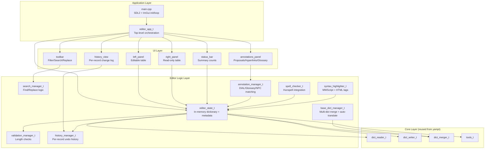

# Design Document: Translation Editor (yampt.gui)

## Overview

A Dear ImGui-based graphical translation editor that provides a WinMerge-like two-panel interface for editing yampt dictionary files. The editor is a separate executable (`yampt.gui.exe`) within the yampt Visual Studio solution, reusing the existing `dict_reader_t`, `dict_writer_t`, `dict_merger_t`, and `tools_t` classes directly.

The application uses an immediate-mode GUI paradigm — the entire UI is rebuilt each frame from application state. This eliminates widget lifecycle management and makes the codebase straightforward: state changes are reflected instantly without event wiring or data binding.

**Key architectural decisions:**
- Single-process, single-threaded application (ImGui is not thread-safe)
- All dictionary data held in memory — files are only touched on load/save
- Reuses yampt's existing `tools_t::dict_t` as the core data structure
- SDL2 backend for window management and input, OpenGL3 for rendering
- Separate VS project (`yampt.gui.vcxproj`) within the existing solution

## Architecture



## Components and Interfaces

### editor_app_t

Top-level class that owns all state and orchestrates the frame loop.

```cpp
class editor_app_t
{
public:
    void init(SDL_Window * window);
    void frame();
    void shutdown();

    bool wants_quit() const;

private:
    editor_state_t state;
    search_manager_t search;
    validation_manager_t validation;
    history_manager_t history;
    annotation_manager_t annotations;
    base_dict_manager_t base_dicts;
    spell_checker_t spell_check;
    syntax_highlighter_t syntax;

    float split_ratio = 0.5f;
    bool show_history = false;
    bool show_annotations = true;

    editor_config_t config;

    void render_menu_bar();
    void render_toolbar();
    void render_panels();
    void render_status_bar();
    void render_annotations_panel();
    void render_history_panel();
    void render_dialogs();
};
```

### editor_state_t

Holds the in-memory representation of both dictionaries and tracks modifications.

```cpp
struct record_view_t
{
    tools_t::rec_type_t type;
    size_t index;
    bool modified = false;
};

class editor_state_t
{
public:
    bool load_user_dict(const std::string & path);
    bool load_source_dict(const std::string & path);
    bool save_user_dict();
    bool save_user_dict_as(const std::string & path);

    tools_t::dict_t & get_user_dict();
    const tools_t::dict_t & get_source_dict() const;

    const std::string & get_user_path() const;
    bool has_unsaved_changes() const;
    void mark_modified(tools_t::rec_type_t type, size_t index);

    std::vector<record_view_t> get_filtered_records(
        const std::set<tools_t::rec_type_t> & type_filter,
        const std::set<std::string> & status_filter,
        const std::string & search_text,
        bool case_sensitive) const;

private:
    tools_t::dict_t user_dict;
    tools_t::dict_t source_dict;
    std::string user_path;
    std::string source_path;
    bool dirty = false;
    std::set<std::pair<tools_t::rec_type_t, size_t>> modified_records;
};
```

### search_manager_t

Handles find, find next/previous, replace, and replace all operations.

```cpp
struct search_match_t
{
    tools_t::rec_type_t type;
    size_t record_index;
    size_t char_start;
    size_t char_end;
    bool in_key;
};

class search_manager_t
{
public:
    void set_query(const std::string & text, bool case_sensitive);
    void find_all(const editor_state_t & state,
                  const std::set<tools_t::rec_type_t> & type_filter);
    const search_match_t * current_match() const;
    void next_match();
    void prev_match();
    void replace_current(editor_state_t & state, const std::string & replacement);
    size_t replace_all(editor_state_t & state, const std::string & replacement);

    const std::vector<search_match_t> & get_matches() const;
    size_t current_index() const;

private:
    std::string query;
    bool case_sensitive = false;
    std::vector<search_match_t> matches;
    size_t current = 0;
};
```

### validation_manager_t

Checks byte-length constraints per record type.

```cpp
enum class validation_level_t { ok, caution, warning, error };

struct validation_result_t
{
    validation_level_t level;
    size_t byte_count;
    size_t limit;
};

class validation_manager_t
{
public:
    validation_result_t validate(tools_t::rec_type_t type,
                                 const std::string & value) const;
};
```

Validation rules:
| Type | Warning | Error |
|------|--------:|------:|
| CELL |      64 |    64 |
| FNAM |      32 |    32 |
| RNAM |      33 |    33 |
| INFO |     512 |  1024 |

(CELL/FNAM/RNAM have hard limits — exceeding them is always an error. INFO has a two-tier system: >512 = caution, >1024 = error.)

### history_manager_t

Maintains per-record change history with timestamps.

```cpp
struct history_entry_t
{
    std::string value;
    std::string timestamp;
};

class history_manager_t
{
public:
    void record_change(tools_t::rec_type_t type, const std::string & key,
                       const std::string & old_value, const std::string & new_value);
    std::vector<history_entry_t> get_history(tools_t::rec_type_t type,
                                             const std::string & key) const;
    void revert(editor_state_t & state, tools_t::rec_type_t type,
                const std::string & key, size_t history_index);

    void load_from_file(const std::string & path);
    void save_to_file(const std::string & path) const;

private:
    std::unordered_map<std::string, std::vector<history_entry_t>> entries;
};
```

### annotation_manager_t

Finds DIAL topics, glossary terms, and NPC gender flags within INFO record text.

```cpp
struct annotation_t
{
    size_t start;
    size_t end;
    enum kind_t { dial_topic, glossary_term, speaker_gender };
    kind_t kind;
    std::string original;
    std::string translated;
};

class annotation_manager_t
{
public:
    void rebuild(const editor_state_t & state);
    std::vector<annotation_t> annotate(const std::string & text,
                                       tools_t::rec_type_t type) const;

private:
    std::vector<std::pair<std::string, std::string>> dial_topics;
    std::vector<std::pair<std::string, std::string>> glossary_terms;
    std::unordered_map<std::string, std::string> npc_flags;
};
```

Matching logic mirrors yampt's `add_annotations`: case-insensitive substring search where the character immediately before the match must not be alphabetic (word-boundary check).

### base_dict_manager_t

Manages multiple base dictionaries with ordered merge and auto-translation.

```cpp
struct auto_translate_result_t
{
    size_t translated = 0;
    size_t skipped_no_match = 0;
    size_t skipped_text_changed = 0;
};

struct fuzzy_match_t
{
    std::string matched_key;
    std::string matched_value;
    float similarity;
};

class base_dict_manager_t
{
public:
    void set_paths(const std::vector<std::string> & paths);
    void reload();
    const tools_t::dict_t & get_merged_dict() const;

    auto_translate_result_t auto_translate_from_base(editor_state_t & state);
    auto_translate_result_t auto_translate_identical(editor_state_t & state);

    std::vector<fuzzy_match_t> find_fuzzy_matches(
        const std::string & text, tools_t::rec_type_t type,
        size_t max_results = 5) const;

private:
    std::vector<std::string> paths;
    dict_merger_t merger;
};
```

### syntax_highlighter_t

Provides token ranges for colorized rendering of SCTX and TEXT records.

```cpp
enum class token_type_t
{
    normal,
    mwscript_function,
    mwscript_comment,
    mwscript_string,
    html_tag,
};

struct token_t
{
    size_t start;
    size_t end;
    token_type_t type;
};

class syntax_highlighter_t
{
public:
    std::vector<token_t> tokenize(const std::string & text,
                                  tools_t::rec_type_t type) const;
};
```

### spell_checker_t

Wraps Hunspell for spell checking translated text.

```cpp
class spell_checker_t
{
public:
    bool init(const std::string & aff_path, const std::string & dic_path);
    bool is_correct(const std::string & word) const;
    std::vector<std::string> suggest(const std::string & word) const;
    void add_to_custom_dict(const std::string & word);
    void set_language(const std::string & aff_path, const std::string & dic_path);

private:
    std::unique_ptr<Hunspell> hunspell;
    std::vector<std::string> custom_words;
    std::string custom_dict_path;
};
```

### editor_config_t

Persists user preferences between sessions.

```cpp
class editor_config_t
{
public:
    void load(const std::string & path);
    void save(const std::string & path) const;

    float split_ratio = 0.5f;
    std::array<float, 4> column_widths = {150.f, 300.f, 300.f, 80.f};
    std::vector<std::string> base_dict_paths;
    std::string spell_check_aff;
    std::string spell_check_dic;
    std::string last_user_dict_path;
    std::string last_source_dict_path;
};
```

## Data Models

### Dictionary JSON Format (existing)

```json
{
  "CELL": [
    { "id": "record key text", "old": "original text", "new": "translated text", "status": "translated" }
  ],
  "DIAL": [ ... ],
  "INFO": [ ... ]
}
```

Fields map to `tools_t::record_entry_t`:
- `id` → `key_text` (the record identifier / original-language key)
- `old` → `old_text` (original text from the source ESM)
- `new` → `new_text` (translated text, editable)
- `status` → `status` (translation state string)

### Status Values

| Status String            | Display Name     | Meaning                                    |
|--------------------------|------------------|--------------------------------------------|
| `""` or `"untranslated"` | Untranslated     | No translation provided                    |
| `"translated"`           | Translated       | Manually translated                        |
| `"auto_identical"`       | Auto (Identical) | Copied from identical record               |
| `"auto_heuristic"`       | Auto (Heuristic) | Heuristic match applied                    |
| `"validated"`            | Validated        | Reviewed and approved                      |
| `"changed"`              | Changed in Base  | Source text differs from base              |
| `"has_errors"`           | Has Errors       | Validation failures                        |

### History Sidecar File Format

Stored as `<dictionary_name>.history.json` alongside the dictionary file:

```json
{
  "CELL:Balmora": [
    { "value": "Balmora", "timestamp": "2025-01-15T10:30:00" },
    { "value": "Балмора", "timestamp": "2025-01-15T10:35:22" }
  ],
  "INFO:some_key": [ ... ]
}
```

### Config File Format

Stored as `yampt_gui.ini` in the executable directory (ImGui INI-style):

```ini
[Editor]
SplitRatio=0.5
ColumnWidths=150,300,300,80
SpellCheckAff=pl_PL.aff
SpellCheckDic=pl_PL.dic

[BaseDicts]
Count=3
Path0=C:\path\to\Morrowind_base.json
Path1=C:\path\to\Tribunal_base.json
Path2=C:\path\to\Bloodmoon_base.json

[Recent]
UserDict=C:\path\to\user_dict.json
SourceDict=C:\path\to\source_dict.json
```
